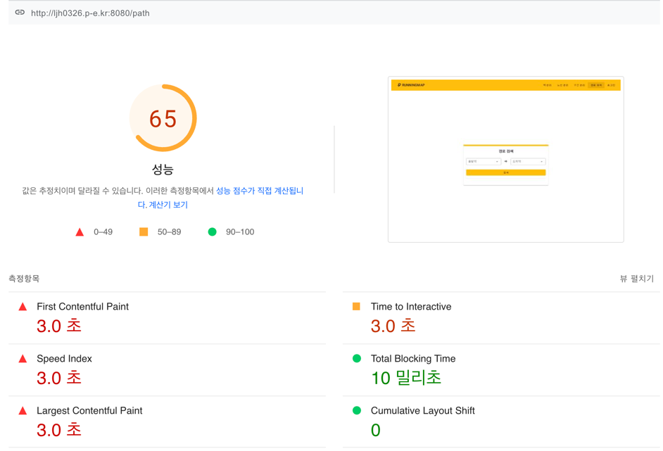

<p align="center">
    
</p>
<p align="center">
  
  
  <a href="https://edu.nextstep.camp/c/R89PYi5H" alt="nextstep atdd">
    
  </a>
  
</p>

<br>

# 인프라공방 샘플 서비스 - 지하철 노선도

<br>

## 🚀 Getting Started

### Install
#### npm 설치
```
cd frontend
npm install
```
> `frontend` 디렉토리에서 수행해야 합니다.

### Usage
#### webpack server 구동
```
npm run dev
```
#### application 구동
```
./gradlew clean build
```
<br>


### 1단계 - 웹 성능 테스트
1. 웹 성능예산은 어느정도가 적당하다고 생각하시나요

``
* First Byte Time : 웹 서버에서 받은 컨텐츠의 첫 번째 바이트가 얼마만에 도착했는가?
* Keep-Alive Enabled : TCP 연결을 재사용하기 위한 Keep-Alive 설정이 되어 있는가?
* Compress Transfer : 스크립트 파일이 Content-Encoding으로 압축되어 있는가?
* Compress Image : 이미지를 압축했는가?
* Cache Static Content : 정적 파일이 캐싱 설정이 되어 있는가?
* Time to Interactive(TTI) : 하위 리소스가 로드되고 사용자 입력에 응답할 수 있는 시점까지 걸린 시간.
  * [TTI](https://web.dev/tti/)
* Total BLocking Time(TBT) : FCP 와 TTI 사이에 총 걸린 시간.
  * [TBT](https://web.dev/tbt/)
* Speed Index : 사용자가 볼수 있는 컨텐츠를 랜더링하는데 걸리는 속도 (낮을수록 좋음).
  * [Speed Index](https://web.dev/speed-index/)
* Largest Contentful Paint(LCP) : 가장 큰 이미지 or 텍스트를 렌더링하는데 걸린 시간.
  * [LCP](https://web.dev/lcp/)
* First Contentful Paint(FCP) : 페이지 콘텐츠의 일부가 화면에 렌더링 될때까지의 시간.
  * [FCP](https://web.dev/fcp/)
  
#### 타사 비교 (First View, 데스크톱)
단위: 초(s)

### 트래픽이 가장 많을걸로 판단되는 메인과 경로검색 페이지의 성능 지표 탐색

#### 메인 페이지


| | [nextstep subway](http://ljh0326.p-e.kr:8080/) |
|----------------|-------------------------------|
|FCP|2.7|
|TTI|2.8|
|Speed Index|2.7|
|LCP|2.9|
|TBT|0.07|

#### 경로 검색 페이지


| |[네이버 지도](https://map.naver.com/v5/directions/-/-/-/transit?c=14137575.5199888,4524330.9973991,15,0,0,0,dh)|[카카오지도](https://map.kakao.com/)|[nextstep subway](http://ljh0326.p-e.kr:8080/)|
|----------------|-------------------------------|-----------------------------|-----------------------------|
|FCP|0.389|0.741|3.0|
|TTI|3.2|2.5|3.0|
|Speed Index|1.931|3.878|3.0|
|LCP|3.975|2.141|3.0|
|TBT|0.021|0.059|0.01|

#### 웹 성능 예산 [nextstep subway](http://ljh0326.p-e.kr:8080/)
|목표|메인|경로검색|
|----------------|-------------------------------|-------------------------------|
|FCP|0.7|0.9|
|TTI|2|2|
|Speed Index|2|2|
|LCP|1|1|
|TBT|유지|

이렇게 정한 이유 개선 필요한 부분과 함께 설명

2. 웹 성능예산을 바탕으로 현재 지하철 노선도 서비스는 어떤 부분을 개선하면 좋을까요
- 정적 자원 압축
    - vendor.js (2,125KB -> 407KB) , main.js (172.0KB -> 28.1KB), stations(70KB -> 6.5KB)로 각각 압축이 가능하다. 데이터 용량이 낮아진 많큼 좀 더 사용자 요청에 응답할 수 있다.

- CDN (캐시)
    - First VIEW와 REPEAT VIEW의 전체적인 성능이 많이 차이난다. 이는 web browser의 캐싱 때문인것으로 추측하고있다. 
      이를 통해 CDN을 통해 더 가까운 네트워크에서 캐싱된 데이터를 받는다면 웹 성능이 많이 향상될 것으로 추측된다.


---

### 2단계 - 부하 테스트 
1. 부하테스트 전제조건은 어느정도로 설정하셨나요

2. Smoke, Load, Stress 테스트 스크립트와 결과를 공유해주세요

---

### 3단계 - 로깅, 모니터링
1. 각 서버내 로깅 경로를 알려주세요

2. Cloudwatch 대시보드 URL을 알려주세요
